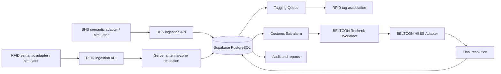

# BELTCON SBTS Final Architecture Review V1

## Scope and evidence

This review covers the uncommitted SBTS Baseline V1 implementation on branch
`fix/bag-lifecycle-pipeline`, base commit `fc90cb5`, reviewed on 2026-07-28.
It is an implementation review, not a production deployment approval or a
formal penetration test. The repository has no configured disposable
Supabase/PostgreSQL environment, Supabase CLI, Docker engine, or `psql` client.
Database assertions are therefore static or service/mock tests only; no
migration was applied and no physical integration was contacted.

## Phase 1–10 preconditions

| Capability | Expected implementation | Actual implementation and evidence | Result | Final-verification impact |
| --- | --- | --- | --- | --- |
| Baseline domain | Strict BHS BagID, message and evaluation contract | `src/domain/beltcon-sbts-baseline/`; `tests/beltcon-sbts-baseline.test.mjs` | PASS | Ready for simulator verification |
| Baseline persistence | Baseline identity and integration fields | migrations 016–018; mapping tests | PARTIAL | Requires a disposable database application |
| BHS ingestion | Equipment-key authenticated message 2001, fingerprint and semantic 2002 | `bhsMessageApi.server.ts`, `bhsMessageService.server.ts`, migration 017 | PASS (mock/static) | Physical transport remains SAT work |
| Tagging | Server queue and atomic RFID barcode/EPC association | `taggingApi.server.ts`, `taggingService.server.ts`, migration 018 | PASS (mock/static) | Database RPC execution not observed |
| RFID | Equipment-key ingestion and server antenna-zone mapping | `rfidReadApi.server.ts`, migration 019 | PASS (mock/static) | Hardware reader transport remains SAT work |
| Customs Exit alarm | One active alarm, versioned actions and Recheck transition | `alarms/`, migration 020 | PASS (mock/static) | Requires runtime database verification |
| Recheck | Queue, tag lookup, simulated HBSS recall, atomic resolution | `recheck/`, migration 021 | PASS (mock/static) | Physical HBSS is intentionally unavailable |
| Query authority | Query keys, server clients and UI-only Zustand | `src/lib/queryKeys.ts`, `src/store/appStore.ts` | PASS | No operational Zustand authority found |
| Read models | Readers, reports, audit pagination/export guards | `readers/`, `reports/`, `audit/`, migration 022 | PASS (mock/static) | Runtime report figures need FAT evidence |
| Access control | Active-profile checks and persisted permission evaluation | `permissionAuthorization.server.ts`, migration 023 | PASS (mock/static) | Permission matrix must be applied to a test database |

## System context and data flow

The browser uses TanStack Query and typed API clients. Authenticated server
routes derive identity from the HttpOnly session, load the active canonical
profile and persisted permissions, validate input, call a domain service, and
then call a server repository/RPC. The browser has no service-role or
integration credential.

## Lifecycle and transaction boundaries

| Transition | Server boundary | Durable result |
| --- | --- | --- |
| BHS `REJECT`/`TIMEOUT`/`NO_DECISION`/`MISTRACK` | `ingest_beltcon_bhs_message_v1` | Integration event and `IDENTIFIED` bag; no alarm or X-ray requirement |
| Tag association | `assign_beltcon_rfid_tag_v1` | Barcode and EPC uniqueness, IATA LPC validation, `TAGGED`, audit |
| RFID read | `process_beltcon_rfid_read_v2` | Immutable event, antenna-derived zone, forward-only lifecycle, Customs Exit alarm when applicable |
| Alarm actions | Versioned alarm RPCs | Action history and audit; send-to-Recheck does not resolve the case |
| HBSS recall | Begin/complete recall RPCs plus server-selected adapter | Durable request/attempt; simulated or unavailable result never resolves the bag |
| Resolution | `resolve_beltcon_recheck_case_v1` | Resolution, bag `RESOLVED`, alarm `CLOSED`, action and audit in one RPC |

Idempotency is scoped to the external BHS source/fingerprint, RFID source event,
and Recheck actor/bag keys. Optimistic versions protect tag assignment, alarm
actions, reader configuration, and final resolution. PostgreSQL-level behavior
is not executed in this environment.

## Identity, authorization, and audit

- Canonical roles are Operations Officer, Control Center Operator, Customs
  Supervisor, Airport Administrator, and System Administrator.
- `loadEffectiveAuthorization()` fails closed for missing, pending, inactive,
  suspended, locked, deactivated, malformed, and inactive-role profiles.
- Persisted `roles`, `permissions`, and `role_permissions` determine access;
  workspace mode and feature flags are UI/configuration inputs, never server
  authority.
- Equipment endpoints require their integration key and cannot use a human
  session. Human operational endpoints require a session and exact permission.
- Final Recheck resolution now requires `bag.resolve`; queue, lookup, and
  recall retain `bag.recheck`.
- Audit, report, and CSV export APIs are server routes with permission checks,
  bounded filters, and CSV formula escaping.

## Frontend and query authority

`src/store/appStore.ts` contains only sidebar, density, map-layer, and simulator
display preferences. Operational data is fetched through server APIs and
centralized keys in `src/lib/queryKeys.ts`. Active queues use the documented
short stale/refetch policy in `src/lib/queryPolicy.ts`; this is polling/refetch
support, not verified cross-browser realtime.

Significant sensitive forms use React Hook Form and Zod. The BHS/RFID simulator,
tag association, alarm, Recheck, reader, report, and audit paths also retain
server Zod validation and mutation pending states. The Recheck UI hides final
resolution when the current effective permission set lacks `bag.resolve`.

## Page authority review

| Page | Current data authority | Browser operational state | Result |
| --- | --- | --- | --- |
| Dashboard | Explicit unavailable-state link to authoritative alarms | None | PARTIAL — dashboard read model deferred |
| Tagging | `useTaggingQueue` and `useAssignRfidTag` server client | Local selection/recent display only | PASS |
| Developer Simulator | Server simulator APIs and query clients | UI tab/playback preference only | PASS (simulation) |
| Alarms | `useAlarms`, detail and alarm mutations | Filters/dialog state only | PASS |
| Recheck | Recheck, X-ray, alarm clients and server mutations | Scan/form/workflow UI state only | PASS |
| Readers | Reader API clients | Filters/dialog UI state only | PASS |
| Reports | Server report client | Filter UI state only | PASS |
| Audit | Server audit panel/client | Filter UI state only | PASS |
| History / Map | Explicit unavailable-state components | None | PARTIAL — operational pages deferred |
| Operations Scan / Supervisor Overview | Explicit unavailable-state components; workspace wrapper is UI only | None | PARTIAL — operational pages deferred |
| Manage Users / Roles | Admin server clients and authorized mutations | Dialog/filter/dirty UI state only | PASS |
| System / Threat settings | Safe health/read configuration views and simulated/not-persisted labels | Local display state only | PARTIAL — non-baseline settings remain simulated |

No reviewed baseline page writes bags, alarms, RFID events, resolutions,
readers, audit records, roles, or users directly from the browser. All direct
route access still passes the server middleware and persisted permission check.

## Migration inventory

| Migration | Purpose | Existing-object effect | Static coverage | Runtime database status |
| --- | --- | --- | --- | --- |
| 001–006 | Profiles, core operational tables, seed readers, realtime, X-ray scans | Establish/extend base schema | Existing tests | NOT EXECUTED |
| 007–010 | Screening ingestion, RPC, authoritative tagging, X-ray view audit | Extends bags/audit and creates RPCs/indexes | Existing tests | NOT EXECUTED |
| 011–014 | Admin profile repair, lifecycle, password completion | Adds/replaces secure profile RPCs | Existing tests | NOT EXECUTED |
| 015 | Persisted roles, permissions, role grants | Creates RBAC tables and role RPC | Existing tests | NOT EXECUTED |
| 016 | SBTS BHS identity, evaluation, tag fields | Additive bag/event constraints and indexes | `beltcon-sbts-baseline-migration` | NOT EXECUTED |
| 017 | BHS 2001 ingestion | Replaces/creates secure ingestion RPC | `beltcon-bhs-ingestion` | NOT EXECUTED |
| 018 | RFID tag association | Adds uniqueness and association RPC | `beltcon-tag-assignment` | NOT EXECUTED |
| 019 | RFID events and antennas | Creates antenna mapping and RFID RPC | `beltcon-rfid-ingestion` | NOT EXECUTED |
| 020 | Customs Exit alarm workflow | Extends alarms, creates actions and RPCs | `beltcon-customs-exit-alarm` | NOT EXECUTED |
| 021 | Recheck, recall, resolution | Creates recall records and resolution RPCs | `beltcon-recheck-workflow` | NOT EXECUTED |
| 022 | Readers, reports, audit read models | Extends reader objects and indexes/RPCs | `beltcon-read-models` | NOT EXECUTED |
| 023 | Security hardening | Adds atomic permissions and replaces role update RPC | `beltcon-security-hardening` | NOT EXECUTED |

All 001–023 migration files are present sequentially. Static inspection shows
baseline RPC execution is revoked from `PUBLIC`, `anon`, and `authenticated`
and granted to `service_role`; migration application itself is unverified.

## Simulator and physical-integration boundary

The BHS and RFID simulator paths submit semantic development events. The HBSS
simulated adapter returns `SIMULATED` and explicitly states that no workstation
or serial device was contacted. The Profinet and RS-232 flags default to false;
no physical LLRP reader, light, buzzer, Profinet, or serial port implementation
was found in the Baseline V1 path.

## Findings and deferred work

### Defects fixed during Phase 11

| Defect | Root cause | Files changed | Verification |
| --- | --- | --- | --- |
| Final resolution used the inspection permission | The Recheck API authorized every action with `bag.recheck`. | `recheckApi.server.ts`, `recheck.tsx`, Recheck tests | Resolution now requires `bag.resolve`; focused and full tests pass. |
| BHS simulator tab content was outside its React component | An orphaned `TabsContent` node left the tab outside the existing `Tabs`. | `dev.simulator.tsx`, architecture conformance test | BHS panel is restored inside the existing tab set; focused architecture test passes. |

| Severity | Finding | Status |
| --- | --- | --- |
| High | No disposable database was available to apply the migration chain or observe RPC transaction/concurrency behavior. | Open; blocks FAT readiness |
| High | Physical BHS, RFID/LLRP, RS-232/HBSS, and light/buzzer integrations are intentionally absent. | Open; blocks SAT/production |
| Medium | Cross-browser realtime was not observed; operational pages use refetch/polling policy. | Open |
| Medium | Legacy pre-BELTCON branding remains in pre-existing UI, migrations, tests, and console labels. | Open; no Phase 11 branding introduced |
| Medium | Backup/restore, HA/failover, load, retention, and penetration testing are not evidenced. | Open |
| Low | Internal X-ray display remains optional; manual inspection remains possible when unavailable. | Accepted baseline behavior |

## Go/no-go finding

The code is suitable for a **conditional isolated software demonstration** only
after the documented simulator setup succeeds against a disposable database.
It is not FAT-ready, SAT-ready, or production-ready until the limitation
register items are resolved or formally accepted.
