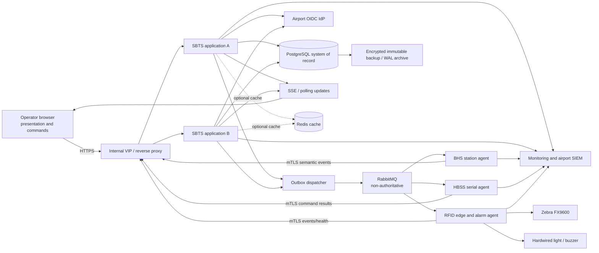
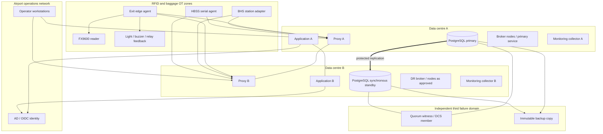
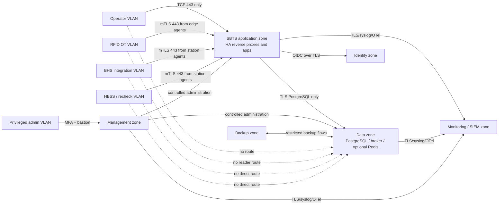
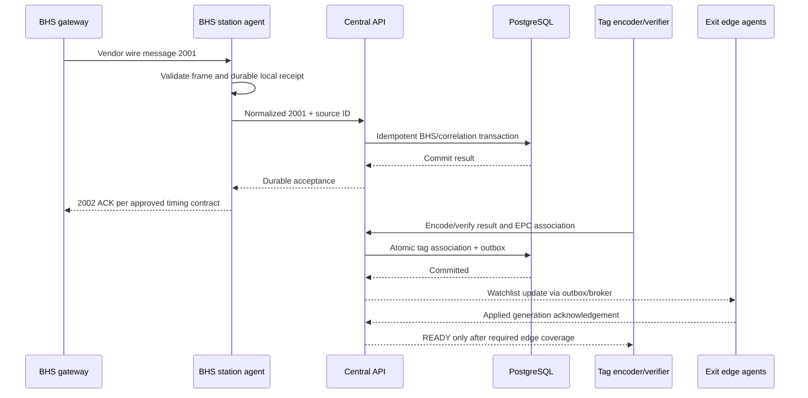
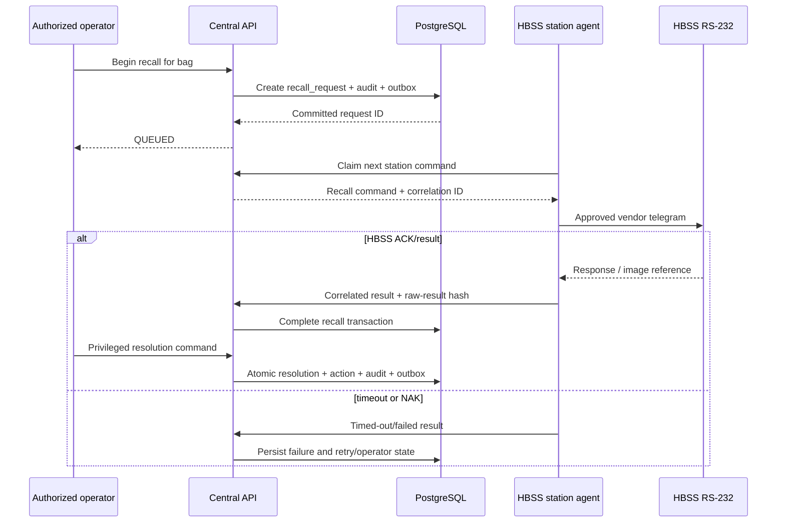

# BELTCON Suspect Bag Tracking System (SBTS)

## Production Architecture, Cybersecurity, Integration, and Resilience Review — V2

**Review date:** 2026-07-29  
**Reviewed branch:** `fix/bag-lifecycle-pipeline`  
**Reviewed revision:** `0007b92` (`database fix`)  
**Deployment constraint:** entirely airport-local; no dependency on a public cloud or the public Internet  
**Decision vocabulary:** **KEEP**, **HARDEN**, **REPLACE**, **REMOVE**, **DEFER**

## Review basis and limits

This is a brownfield review, not a redesign from zero. It is based on the checked-in application, SQL migrations `001` through `024`, Git history, package lock, configuration, tests, and the project's architecture, security, workflow, FAT/SAT, and limitation documents.

The review did **not** have access to a live PostgreSQL instance, Zebra FX9600 hardware, the BHS Profinet gateway, the HBSS serial interface, a physical light/buzzer controller, airport Active Directory, network drawings, vendor interface-control documents, or prior conversations outside this repository. No hardware or database integration claim is therefore treated as verified. Existing semantic contracts are useful, but wire compatibility remains subject to vendor FAT/SAT.

Repository evidence also changes a few conclusions in the older [`BELTCON-SBTS-FINAL-ARCHITECTURE-REVIEW-V1.md`](./BELTCON-SBTS-FINAL-ARCHITECTURE-REVIEW-V1.md): the branch now contains migration `024` and additional BHS/HBSS correlation logic, while the older review inventories only migrations `001`–`023`.

Verification performed for this review:

- `npm test`: **239 tests passed, 0 failed**. The run emitted Vite WebSocket port `24678` collision warnings, which should be fixed for deterministic CI.
- `npm run typecheck`: **passed**.
- `npm run build`: **passed**, but produced a Vercel/Nitro `nodejs24` artifact under `.vercel/output` and warned about JavaScript chunks over 500 kB.
- `npm audit --omit=dev --audit-level=high`: **two high-severity advisories** were present in the resolved dependency tree (`js-yaml` and `postcss`) with fixes available.
- SQL migrations were inspected statically; they were not applied to a disposable or production-equivalent database.

---

# A. Executive verdict

## Production suitability

The current implementation is a **credible functional prototype and a useful domain foundation, but it is not production-ready for an airport operational security system**.

Approximately **70% of the application and domain code can remain** after hardening: the React operator interface, TanStack route/query structure, Zod validation, permission vocabulary, semantic BHS/RFID/HBSS contracts, identifier separation, and several PostgreSQL transactional workflows are reusable. That estimate is about code and design reuse, not operational readiness. Most of the production runtime, device integration, identity integration, network security, high availability, observability, offline behavior, and deployment supply chain still has to be implemented and proven.

The correct target is a **modular on-premises application with a PostgreSQL system of record and separate edge/device agents**. The browser must remain a presentation and command surface. It must never be the authoritative bag state store, the serial-port owner, the RFID decision engine, or the only path to activate an alarm.

## Five most serious risks

1. **Authenticated-user privilege escalation in the database.**  
   [`001_create_profiles_table.sql`](../../supabase/migrations/001_create_profiles_table.sql) permits an authenticated user to update their own entire profile row. No later migration removes or column-restricts that policy. Because [`permissionAuthorization.server.ts`](../../src/services/authorization/permissionAuthorization.server.ts) trusts `profiles.role` and `profiles.status`, a user who obtains their ordinary Supabase token can attempt to promote their own role.

2. **Direct database tampering outside the authoritative server workflows.**  
   [`003_create_core_tables.sql`](../../supabase/migrations/003_create_core_tables.sql) gives every authenticated user broad insert/update rights on bags and RFID events. Later hardening removes several alarm, resolution, and reader policies, but does not remove the original bag and RFID write policies. Avoiding Supabase writes in browser source is not a security boundary when PostgREST/Auth endpoints remain reachable.

3. **No production hardware control path exists.**  
   The FX9600 LLRP session, burst filtering, local edge watchlist, physical light/buzzer, Profinet wire protocol, and HBSS RS-232 driver are absent. [`smithsHbssAdapter.server.ts`](../../src/services/integrations/hbss/smithsHbssAdapter.server.ts) intentionally throws until a vendor ICD exists, and the baseline adapters are placeholders. A browser or central application outage would currently remove the only visible operational workflow.

4. **The checked-in deployment target is public-cloud/serverless shaped.**  
   [`vite.config.ts`](../../vite.config.ts) selects the Nitro `vercel` preset, the build emits `.vercel/output`, current environment endpoints are classified as public Supabase, and public-development remnants include Lovable error reporting and a Google Fonts import. This conflicts with the airport-local constraint and with long-running hardware sessions.

5. **Availability and recovery are unproven.**  
   There is no database failover topology, fencing, restore evidence, immutable backup, device store-and-forward, broker topology, offline software bundle, infrastructure-as-code, monitoring deployment, or tested disaster-recovery runbook. The current tests are valuable unit/static checks but do not validate the failure behavior of a real SBTS.

## Five immediate decisions

1. **Choose PostgreSQL plus separate on-premises identity and event delivery (Supabase option 4).** Preserve useful SQL, replace public Supabase Auth/PostgREST/Realtime and service-role access with airport OIDC, direct server-side PostgreSQL connections, and least-privilege database roles.
2. **Freeze production exposure until migrations remove the dangerous profile, bag, and RFID RLS policies.** Rotate Supabase service/integration keys after the cutover and block direct client access to database APIs.
3. **Approve an edge-continuation safety requirement:** an exit EPC match must activate a local hardwired audiovisual alarm even when the browser, central application, broker, Redis, or inter-DC network is unavailable.
4. **Obtain and approve the three vendor interfaces before production coding is accepted:** BHS message `2001/2002` framing/timing, HBSS RS-232 electrical/telegram/response details, and Zebra FX9600 firmware/LLRP/security configuration.
5. **Adopt an on-premises HA and release baseline:** two application nodes, PostgreSQL primary/standby with a third quorum/witness failure domain and fencing, airport PKI, on-prem monitoring/SIEM, continuous WAL backup, signed offline artifacts, and FAT/SAT/DR evidence as go-live gates.

---

# B. Verified current state

## B1. What is sound and should be preserved

| Verified capability                                                                   | Evidence                                                                                                                                                                                                                                                                                            | Assessment                                                                                      |
| ------------------------------------------------------------------------------------- | --------------------------------------------------------------------------------------------------------------------------------------------------------------------------------------------------------------------------------------------------------------------------------------------------- | ----------------------------------------------------------------------------------------------- |
| Clear separation of BHS BagID, IATA license-plate code, RFID EPC, and printed barcode | [`beltconSbtsBaseline.types.ts`](../../src/domain/beltcon-sbts-baseline/beltconSbtsBaseline.types.ts), migration [`016`](../../supabase/migrations/016_beltcon_sbts_baseline_identity_and_messages.sql)                                                                                             | **KEEP**. Do not collapse these identifiers into one overloaded field.                          |
| Server API → service → repository/RPC layering                                        | `src/routes/api.*`, `src/services/**/**Api.server.ts`, `**Service.server.ts`, `**Repository.server.ts`                                                                                                                                                                                              | **KEEP/HARDEN**. This is the correct application boundary.                                      |
| Server-derived RFID antenna zone                                                      | [`readerAntennaRepository.server.ts`](../../src/services/rfid/readerAntennaRepository.server.ts), migrations [`019`](../../supabase/migrations/019_create_beltcon_rfid_ingestion_and_antenna_mapping.sql) and [`020`](../../supabase/migrations/020_create_beltcon_customs_exit_alarm_workflow.sql) | **KEEP**. A device must not be trusted to declare itself an exit zone.                          |
| Atomic RFID event/alarm/bag/action/audit transition                                   | `process_beltcon_rfid_read_v2` in migration [`020`](../../supabase/migrations/020_create_beltcon_customs_exit_alarm_workflow.sql), called by [`rfidReadRepository.server.ts`](../../src/services/rfid/rfidReadRepository.server.ts)                                                                 | **KEEP/HARDEN**. Preserve single-transaction semantics.                                         |
| Duplicate active-alarm prevention                                                     | Partial unique index in migration [`020`](../../supabase/migrations/020_create_beltcon_customs_exit_alarm_workflow.sql)                                                                                                                                                                             | **KEEP**. Add concurrency and failover tests.                                                   |
| Atomic recall/resolution workflows with permissioned server APIs                      | migration [`021`](../../supabase/migrations/021_create_beltcon_recheck_hbss_resolution_workflow.sql), [`recheckApi.server.ts`](../../src/services/recheck/recheckApi.server.ts)                                                                                                                     | **KEEP/HARDEN**. Connect to a real station agent rather than the placeholder adapter.           |
| BHS acknowledgement follows durable commit in the semantic baseline                   | [`ADR-BELTCON-SBTS-BASELINE-V1.md`](./ADR-BELTCON-SBTS-BASELINE-V1.md), [`bhsMessageService.server.ts`](../../src/services/bhs/bhsMessageService.server.ts)                                                                                                                                         | **KEEP**, subject to vendor acknowledgement timing semantics.                                   |
| Browser operational data goes through server APIs                                     | [`BELTCON-SBTS-FRONTEND-DATA-AUTHORITY-V1.md`](./BELTCON-SBTS-FRONTEND-DATA-AUTHORITY-V1.md), query clients under `src/services`                                                                                                                                                                    | **KEEP/HARDEN**. Enforce it structurally by removing the direct database browser surface.       |
| Zustand contains interface preferences, not bag truth                                 | [`appStore.ts`](../../src/store/appStore.ts)                                                                                                                                                                                                                                                        | **KEEP**. Its sidebar, density, map layer, and simulator UI state are appropriate client state. |
| Simulators and feature flags are separated from production adapters                   | [`beltconSbtsBaseline.featureFlags.ts`](../../src/domain/beltcon-sbts-baseline/beltconSbtsBaseline.featureFlags.ts), `src/features/simulator`                                                                                                                                                       | **KEEP/HARDEN**. Exclude simulator routes and seed data from production artifacts.              |

## B2. Authoritative server workflows versus browser-only or placeholder behavior

### Authoritative or nearly authoritative today

- **Screening suspect ingestion:** the integration route validates a shared key, hashes the request, and invokes server repositories/RPCs. Migration `024` adds BHS/HBSS correlation and tagging readiness. This is a useful semantic workflow, but the physical screening system adapter and network authentication remain incomplete.
- **BHS message ingestion:** [`api.integrations.bhs.messages.ts`](../../src/routes/api.integrations.bhs.messages.ts) calls the BHS API/service/repository sequence. Persistence and duplicate handling are server-side. The wire-level Profinet gateway connection does not exist.
- **RFID tag assignment and encoding state:** tagging routes call server services and migration `018` RPCs. A committed tag association is authoritative; an EPC is an association, not the BagID itself.
- **RFID event and exit alarm:** the server invokes `process_beltcon_rfid_read_v2`; this is the strongest current workflow because the event, bag state, alarm, action, and audit entry share one transaction.
- **Alarm acknowledgement/escalation/send-to-recheck:** server routes and permission checks exist.
- **Recheck recall and resolution:** server routes, permission checks, and database RPCs exist. The HBSS device operation is still simulated/unavailable.
- **Reader configuration, reports, and audit:** server APIs exist, but their production scalability and immutability need work.

### Browser-only, unavailable, or non-authoritative today

- [`index.tsx`](../../src/routes/index.tsx), [`map.tsx`](../../src/routes/map.tsx), [`history.tsx`](../../src/routes/history.tsx), [`ops.scan.tsx`](../../src/routes/ops.scan.tsx), and [`supervisor.overview.tsx`](../../src/routes/supervisor.overview.tsx) render `OperationalDataUnavailable`; they are not live operational views.
- [`realtimeService.ts`](../../src/services/realtimeService.ts) is a stub. Operational hooks poll; no verified event push exists.
- Legacy [`bagService.ts`](../../src/services/bagService.ts), [`alarmService.ts`](../../src/services/alarmService.ts), [`eventService.ts`](../../src/services/eventService.ts), and [`persistenceService.ts`](../../src/services/persistenceService.ts) are fail-closed/deprecated facades and should not become production pathways.
- [`recheckService.server.ts`](../../src/services/recheck/recheckService.server.ts) defaults to simulation, while its RS-232 implementation reports unavailable.
- [`smithsHbssAdapter.server.ts`](../../src/services/integrations/hbss/smithsHbssAdapter.server.ts) deliberately refuses operation without the vendor ICD.
- No source implements LLRP reader management, a serial port, Profinet, relay/PLC/GPIO alarm output, a local edge queue, a broker client, or a cache client.

The claim in the root `DEMO.md` that the application supports optimistic offline synchronization and live operational views conflicts with the authority document and current routes. Production documentation must be generated from tested behavior, not retained marketing/demo statements.

## B3. Current technical debt and contradictions

1. **Two incompatible bag status vocabularies.**  
   Migration [`003`](../../supabase/migrations/003_create_core_tables.sql) allows `IN_ARRIVAL_HALL`, `AT_EXIT`, and `UNDER_RECHECK`, while [`src/types/bag.ts`](../../src/types/bag.ts) uses `IN_TRANSIT` and `AT_RECHECK`. [`bagPersistenceMappings.ts`](../../src/services/bagPersistenceMappings.ts) collapses several database statuses, and migration `024` checks values the database constraint does not permit. One canonical database lifecycle must generate application types.

2. **Broad service-role repositories.**  
   [`supabaseAdmin.server.ts`](../../src/services/supabaseAdmin.server.ts) creates a service-role client used across repositories. This bypasses RLS and turns every repository defect into a high-impact database credential path.

3. **Overlong refresh sessions.**  
   [`authRepository.server.ts`](../../src/services/authRepository.server.ts) permits a ten-year refresh-cookie age, and [`register.tsx`](../../src/routes/register.tsx) describes it to users. This is unsuitable for a privileged airport system.

4. **Self-registration in a controlled system.**  
   Registration is protected by an ETB key rather than an identity lifecycle integrated with airport HR/AD and approval. Disable self-registration in production.

5. **Static integration keys.**  
   BHS, RFID, and screening routes authenticate with shared header secrets. They provide a useful development boundary but no per-device identity, revocation, certificate binding, or strong non-repudiation.

6. **Insufficient RFID duplicate model.**  
   Migration `019` handles exact source-event IDs/fingerprints. It does not implement reader/antenna/EPC temporal burst coalescing. Edge filtering is needed to control volume, while exact durable idempotency remains in PostgreSQL.

7. **Reports and audit are bounded in application memory.**  
   [`operationalReportRepository.server.ts`](../../src/services/reports/operationalReportRepository.server.ts) loads at most 25,000 rows before aggregating. [`auditRepository.server.ts`](../../src/services/audit/auditRepository.server.ts) loads at most 10,000 rows before filtering/pagination. Results can become incomplete while appearing final.

8. **Audit records are mutable by privileged code.**  
   Migration [`007`](../../supabase/migrations/007_create_screening_ingestion.sql) creates the audit table, but migration [`024`](../../supabase/migrations/024_beltcon_hbss_bhs_correlation_and_tagging_readiness.sql) updates historical event/audit foreign keys and deletes duplicate bags during repair. Production audit needs append-only correction/alias events and tamper-evident export.

9. **X-ray storage is only a reference model.**  
   `xray_scans` stores JSON references/URLs; there is no verified local object store, integrity digest, storage encryption, retention, legal hold, or audited delivery mechanism.

10. **Production packaging is missing.**  
    There are no production container files, service units, infrastructure definitions, CI pipelines, offline dependency bundles, SBOMs, or signed releases in the repository.

---

# C. Technology decision matrix

| Layer                   | Current technology                    |              Decision | Final production choice                                                                                     | Reason                                                                                 | Priority | Migration impact |
| ----------------------- | ------------------------------------- | --------------------: | ----------------------------------------------------------------------------------------------------------- | -------------------------------------------------------------------------------------- | -------: | ---------------- |
| Web UI                  | React 19 + TypeScript                 |              **KEEP** | React/TypeScript operator UI                                                                                | Current components and workflows are reusable.                                         |       P1 | Low              |
| Routing/server UI       | TanStack Start/Router                 |       **KEEP/HARDEN** | Long-running Node.js modular monolith                                                                       | Useful server boundary; remove serverless assumptions and pin supported versions.      |       P0 | Medium           |
| Server state/query      | TanStack Query                        |              **KEEP** | API cache with polling/SSE invalidation                                                                     | Correctly treats browser state as a cache.                                             |       P1 | Low              |
| Validation              | Zod                                   |              **KEEP** | Shared semantic schemas plus vendor-wire parsers                                                            | Good boundary validation; add byte-level parsers and fuzz tests.                       |       P1 | Low              |
| Browser state           | Zustand                               |              **KEEP** | UI preferences only                                                                                         | Current scope is appropriate.                                                          |       P1 | None             |
| Runtime target          | Nitro `vercel` preset                 |           **REPLACE** | Linux Node service under Podman/systemd or airport container platform                                       | Airport-local, long-running, observable runtime is required.                           |       P0 | Medium           |
| System of record        | PostgreSQL through Supabase           |       **KEEP/HARDEN** | Airport-managed PostgreSQL HA                                                                               | Transactions/RPCs are the strongest current asset.                                     |       P0 | High             |
| Browser/database access | Supabase PostgREST + anon endpoint    |            **REMOVE** | Browser → application BFF only                                                                              | Eliminates direct policy-bypass/tampering surface.                                     |       P0 | Medium           |
| Server/database client  | Supabase service-role client          |           **REPLACE** | `pg` connection pools with least-privilege DB roles and explicit transactions                               | Removes global RLS bypass from ordinary repositories.                                  |       P0 | High             |
| Identity                | Supabase Auth                         |           **REPLACE** | Existing airport OIDC IdP; on-prem Keycloak federated to AD/LDAP only if necessary                          | Central account lifecycle, MFA, disablement, and audit.                                |       P0 | High             |
| Authorization           | Application permissions in PostgreSQL |       **KEEP/HARDEN** | Stable external subject → local RBAC/ABAC                                                                   | Existing permission vocabulary is useful; make DB access least privilege.              |       P0 | Medium           |
| Sessions                | Supabase JWT/refresh cookies          |           **REPLACE** | OIDC authorization-code + PKCE; short opaque BFF session cookie                                             | Removes ten-year bearer refresh token exposure.                                        |       P0 | High             |
| Realtime                | Supabase publication/stub/polling     |           **REPLACE** | Server-Sent Events with polling fallback                                                                    | One-way operational updates are sufficient and simpler to operate.                     |       P2 | Medium           |
| RFID device integration | Semantic HTTP ingestion/simulator     |           **REPLACE** | .NET LTS edge agent using vendor-supported LLRP/SDK                                                         | Hardware lifecycle, local queue, device identity, and health are separate concerns.    |       P0 | High             |
| RFID deduplication      | Exact DB idempotency                  |            **HARDEN** | Edge temporal coalescing + central exact idempotency                                                        | Controls read bursts without risking suppression of a true exit alarm.                 |       P0 | Medium           |
| Physical alarm          | UI alarm state only                   |           **REPLACE** | Edge-controlled hardwired light/buzzer via approved relay/PLC/GPIO                                          | Alarm must continue through central/browser failure.                                   |       P0 | High             |
| BHS integration         | Semantic 2001/2002 API                |            **HARDEN** | Station/zone .NET adapter with SQLite store-and-forward and vendor wire driver                              | Retains semantics while isolating industrial protocol and outage handling.             |       P0 | High             |
| HBSS integration        | Mock/unavailable RS-232 adapter       |           **REPLACE** | Station .NET serial agent with durable command/result queue                                                 | Browser and central web process must not own a COM port.                               |       P0 | High             |
| Event dispatch          | Direct transactions only              |            **HARDEN** | PostgreSQL transactional outbox                                                                             | Prevents commit/publish split-brain.                                                   |       P0 | Medium           |
| Message broker          | None                                  |    **DEFER then ADD** | RabbitMQ quorum queues for post-commit commands/notifications                                               | Useful for retries and routing, but never the system of record or alarm critical path. |       P1 | Medium           |
| NATS/JetStream          | None                                  |             **DEFER** | Re-evaluate only if airport standardizes it                                                                 | RabbitMQ better matches explicit command routing/DLQ needs today.                      |       P3 | None             |
| Redis                   | None                                  |    **DEFER/OPTIONAL** | Cache only, with PostgreSQL bypass                                                                          | Must never hold authoritative bag state or suppress alarms.                            |       P2 | Low              |
| RFID event storage      | Plain PostgreSQL tables               |       **KEEP/HARDEN** | Native range partitioning by event time                                                                     | Sufficient until measured volume proves otherwise.                                     |       P1 | Medium           |
| TimescaleDB             | None                                  |             **DEFER** | No extension at initial production                                                                          | Avoids extension/upgrade burden without proven need.                                   |       P3 | None             |
| Reports                 | Node in-memory aggregation            |           **REPLACE** | SQL views/materialized views and server-side pagination                                                     | Removes silent truncation and scales predictably.                                      |       P1 | Medium           |
| Audit                   | PostgreSQL mutable rows               |            **HARDEN** | Append-only audit, restricted owner, signed daily digest, immutable SIEM/archive copy                       | Provides evidentiary integrity and correction history.                                 |       P0 | High             |
| X-ray images            | JSON URL/reference                    | **HARDEN/DEFER COPY** | Prefer authoritative HBSS recall; if copied, airport S3-compatible/NAS storage with checksums and retention | Minimizes sensitive image duplication.                                                 |       P1 | Medium           |
| Secrets                 | `.env`-driven                         |           **REPLACE** | Airport secrets manager/HSM-backed PKI; injected service credentials                                        | `.env` is not an operational secret lifecycle.                                         |       P0 | Medium           |
| Observability           | Application logs only                 |           **REPLACE** | OpenTelemetry + Prometheus/Grafana/Alertmanager + airport SIEM                                              | Required for device and workflow fault detection.                                      |       P0 | Medium           |
| Orchestration           | None                                  |  **DEFER Kubernetes** | Enterprise Linux VMs with Podman/systemd unless airport already operates a supported cluster                | Minimizes platform complexity for a small critical system.                             |       P1 | Medium           |
| Development tooling     | Lovable/Vercel/Google Fonts           |            **REMOVE** | Fully local build assets and error telemetry                                                                | No public Internet dependency or external telemetry.                                   |       P0 | Low              |

---

# D. Recommended production stack

## D1. Application shape

Retain a **modular monolith** for the central business application. Splitting tagging, alarms, recheck, users, reports, and audit into networked microservices would add failure modes without creating a justified scaling boundary. Separate only the processes that have a real lifecycle or safety boundary:

- central web/API application;
- RFID edge/alarm agent at each controlled exit;
- BHS gateway adapter at each tagging integration point or resilient integration zone;
- HBSS serial agent at each recheck station;
- asynchronous outbox dispatcher/workers;
- monitoring and database infrastructure.

The Node application should run as two stateless active-active instances, one in each airport data centre, behind an internal VIP/reverse-proxy pair. It should serve the compiled React UI and internal API. No operational request may depend on Vercel, Lovable, Google Fonts, a public CDN, or public Supabase.

## D2. PostgreSQL and data authority

Use airport-managed PostgreSQL as the single authoritative data store:

- one canonical bag lifecycle and identifier model;
- database-enforced foreign keys and invariants;
- atomic functions for alarm creation, tag association, recall state, and resolution where they protect multi-table consistency;
- direct server connections using TLS and distinct login roles such as `sbts_app_rw`, `sbts_report_ro`, `sbts_audit_append`, and `sbts_migrator`;
- no database listener exposed to operator VLANs;
- no browser credentials, PostgREST, or service-role JWT;
- PgBouncer only if measured connection demand requires it, using a pooling mode compatible with transactions and prepared statements;
- native time partitions for high-volume RFID/read telemetry, with tested retention and index management;
- transactional outbox rows committed with the domain transaction.

Migration ownership must be separated from runtime ownership. The runtime role must not create/drop schema, disable triggers, mutate audit history, or grant itself permissions.

## D3. Identity and access

Prefer the airport's existing supported OIDC identity provider. If it cannot provide OIDC, deploy on-premises Keycloak and federate it to Active Directory/LDAP over LDAPS as described in the [Keycloak server administration guide](https://www.keycloak.org/docs/latest/server_admin/). Do not deploy Keycloak merely to duplicate an existing enterprise IdP.

Authentication flow:

1. Browser uses OIDC authorization-code flow with PKCE through the application BFF.
2. Application stores an opaque, rotated session identifier in an `HttpOnly; Secure; SameSite=Strict` cookie.
3. Server maps the immutable IdP subject to a local operator record and current SBTS role/permissions.
4. Account disablement, role changes, and station assignments take effect promptly; high-risk changes revoke active sessions.
5. Supervisors and administrators use phishing-resistant MFA such as FIDO2/WebAuthn. Badge-plus-PIN may be used for operators only after the badge technology, PIN verifier, lockout, and shared-workstation threat model are approved.
6. Maintain two sealed, monitored, locally authenticated break-glass administrator accounts with short-lived activation, dual control, and immediate audit/alerting.

Current NIST guidance is [SP 800-63-4](https://pages.nist.gov/800-63-4/), which superseded revision 3. The target should meet an AAL2-equivalent operational policy for privileged roles: two factors, protected channels, replay resistance, phishing-resistant authentication offered, no arbitrary password-composition rules, compromised-password screening, and bounded sessions. A practical starting policy is an overall session no longer than 12 hours, 30-minute privileged inactivity, 60-minute operator inactivity, and step-up authentication for user/role/security changes.

## D4. Device and integration implementation language

Use **C# on a current .NET LTS release** as the default implementation for RFID, Profinet-gateway, RS-232, relay/PLC, and station-agent services. It provides mature serial APIs, strong Windows and Linux service support, good vendor-SDK compatibility, typed protocol parsers, and reliable long-running process behavior. If an approved vendor SDK supports only Java or only a particular Windows runtime, the vendor-supported platform takes precedence and remains isolated behind the same semantic contract.

TypeScript remains appropriate for central semantic schemas, simulators, APIs, and the web application. It should not own the physical COM port, a persistent LLRP session, or a hardwired alarm output.

## D5. Edge continuation and RFID

Each controlled exit needs a local industrial PC/controller or airport-approved appliance on the RFID/OT VLAN:

- maintains the FX9600 LLRP connection;
- normalizes reader/antenna/EPC/RSSI/time into a versioned event;
- persists unsent events in a local SQLite WAL database;
- maintains a signed, versioned local watchlist of active suspect EPCs and configuration;
- performs burst coalescing for telemetry using EPC + reader + antenna + configured window;
- activates a hardwired audiovisual alarm immediately on the first matching read;
- sends the event and local alarm result to central services over mutually authenticated TLS;
- continues with its last verified watchlist during central, broker, cache, or browser outage;
- raises a visible `DEGRADED_COVERAGE` condition when its watchlist expires, storage is near full, a relay feedback check fails, or the reader is disconnected.

The first matching exit read must never be discarded because Redis, a browser cache, or a previous in-memory read says it is a duplicate. Edge coalescing reduces repeated telemetry only after the local alarm decision. Central PostgreSQL still enforces exact idempotency by immutable source event ID and prevents multiple active alarms.

Zebra documents LLRP support for the FX9600. Some Zebra portal material specifies TLS 1.2/FIPS capabilities rather than TLS 1.3, so the exact installed firmware and cipher support must be confirmed against the [official interface-control guide](https://www.zebra.com/content/dam/support-dam/en/documentation/unrestricted/guide/software/interface-control-guide-en.pdf). If the reader cannot meet the application TLS baseline, isolate it on a dedicated RFID VLAN and let the edge agent terminate a modern mTLS connection upstream.

## D6. BHS tagging integration

The BHS adapter must turn the vendor wire message into the existing semantic `2001` command, validate and persist it locally, forward it to the central application, and return `2002` according to the approved acknowledgement contract.

Default safety rule: **send `2002` only after the central database commits the message, bag correlation, and idempotency record**. If the BHS vendor requires an acknowledgement before a central round trip, the airport and vendor must explicitly approve local durable acceptance as the acknowledgement boundary. In that model the station SQLite commit becomes a custody event and must be replayed until central acceptance; an in-memory receive is never sufficient.

Tagging readiness must include more than a successful database association. Before the bag leaves the tagging position, the station must show that:

- BHS/HBSS correlation is unambiguous;
- the EPC/barcode encode and verification succeeded;
- the tag association committed centrally;
- the applicable edge watchlist generation was acknowledged, or an approved hold/manual-control SOP is active.

## D7. HBSS recheck

The central application creates a durable `recall_request` and outbox event. The station agent claims commands for its configured station, writes the approved RS-232 telegram, captures the exact bytes/result/timestamps, and posts a correlated result. Timeouts and retries are state transitions, not browser timers.

The existing STX + BagID + CRLF generator is only a hypothesis until the vendor confirms baud rate, data bits, parity, stop bits, flow control, encoding, checksum/LRC, field widths, response/ACK/NAK framing, retry intervals, and whether the requested identifier is BagID or IATA license plate. Resolution remains a privileged, server-authorized, atomic workflow after the image/recall result is available.

## D8. Messaging, cache, realtime, and images

- **PostgreSQL outbox:** mandatory. It is the reliable boundary between domain commits and all asynchronous publication.
- **RabbitMQ:** add after the outbox for commands, notifications, retries, dead-lettering, and workload isolation. Use durable [quorum queues](https://www.rabbitmq.com/docs/quorum-queues), publisher confirms, manual consumer acknowledgements, and idempotent consumers. Delivery is at least once; duplicates are normal.
- **Broker topology:** RabbitMQ [clustering guidance](https://www.rabbitmq.com/docs/clustering) calls for an odd number of voting members and low-latency LAN behavior. With only two data centres, a symmetric “survive either site automatically” three-node quorum is impossible without a third independent failure domain. Use a third witness/fault domain if supported, or operate a primary three-node cluster and a separate DR cluster fed by outbox/federation with an explicit DR runbook. Broker loss must not stop database commits or the local alarm.
- **Redis:** optional only after load evidence. Use it for read-through caches, rate hints, or non-authoritative presence; bypass it on failure. Redis [replication is asynchronous](https://redis.io/docs/latest/operate/oss_and_stack/management/replication/), and even `WAIT` is not a substitute for PostgreSQL durability.
- **UI updates:** server-sent events from the central application, with existing polling behavior as fallback. A missed push event merely delays a screen refresh; it never changes alarm truth.
- **X-ray images:** prefer recall from the authoritative HBSS rather than copying images into SBTS. If operational or evidentiary retention is mandated, use an airport-supported local S3-compatible or NAS platform with encryption, object versioning/immutability where required, SHA-256 stored in PostgreSQL, short-lived audited access, and an approved retention/disposal schedule.

## D9. Deployment and operations

Use enterprise Linux VMs in both airport data centres, with Podman/systemd or the airport's already-supported container platform. Docker Compose is suitable for development and FAT, not the HA production control plane. Defer Kubernetes/k3s unless an airport platform team already operates, patches, monitors, and supports it.

Every release must be producible offline as:

- pinned application and base-image artifacts;
- dependency/vendor package mirror;
- CycloneDX or SPDX SBOM;
- vulnerability and license report;
- malware-scan evidence;
- digital signature verified against airport-controlled keys;
- database migration preflight and rollback/forward-fix plan;
- prior known-good application artifact for rapid rollback.

Database changes use expand/contract migrations. A release must never depend on rolling back a destructive data migration.

---

# E. Supabase disposition

## Direct choice: option 4

**Choose option 4: retain PostgreSQL and useful schema/function design, but replace Supabase Auth, PostgREST/browser access, Realtime, managed-cloud dependencies, and the service-role repository model with separate on-premises components.**

Why not the alternatives:

1. **Managed Supabase Cloud — REMOVE.** It violates the explicit airport-local/no-public-cloud constraint and exposes identity/data control planes outside the airport boundary.
2. **Self-host the complete Supabase platform — REJECT for initial production.** It could be made local, but introduces Kong/PostgREST/GoTrue/Realtime/storage operational burden and preserves an unnecessary browser-to-database API surface. The application already has a server API.
3. **Use Supabase only as a packaged PostgreSQL/API layer — REJECT.** The API layer is exactly where the current broad RLS and service-role risks arise.
4. **Plain PostgreSQL plus separate IdP/realtime — APPROVE.** It preserves the strongest database work, narrows attack surface, fits airport identity, and supports a conventional HA/backup model.

Migration sequence:

1. Add a direct PostgreSQL repository implementation behind current service interfaces.
2. Create restricted runtime, report, audit-append, and migration roles.
3. Add external-subject identity mapping and OIDC BFF sessions.
4. Remove all browser Supabase imports except during a short, controlled authentication migration.
5. Block PostgREST/Auth endpoints at the network layer, then remove Supabase clients and keys.
6. Replace Realtime publication with application SSE and polling fallback.
7. Rotate and destroy former anon/service/integration secrets after validation.

---

# F. Architecture and workflow diagrams

## F1. Logical component architecture



## F2. Physical deployment across airport zones



## F3. Network zoning



Default deny rules must be expressed as firewall policy, not only as diagram annotations. Reader management should be reachable only from its assigned edge agent and controlled management hosts.

## F4. RFID exit alarm flow with edge continuation

```mermaid
sequenceDiagram
    participant FX as FX9600
    participant E as Edge alarm agent
    participant HW as Light/buzzer
    participant API as Central API
    participant PG as PostgreSQL
    participant UI as Operator UI

    FX->>E: LLRP EPC read
    E->>E: Normalize; persist source event
    E->>E: Check signed local active-EPC watchlist
    alt EPC is active suspect
        E->>HW: Activate alarm immediately
        HW-->>E: Relay/output feedback
    end
    E->>API: mTLS event + immutable source ID + alarm result
    alt central available
        API->>PG: process_rfid_read transaction
        PG->>PG: idempotency + bag + alarm + action + audit + outbox
        PG-->>API: committed authoritative result
        API-->>E: accepted / duplicate
        API-->>UI: SSE invalidation
    else central unavailable
        E->>E: Retain in SQLite WAL and retry
        Note over E,HW: Local alarm continues; browser is irrelevant
    end
```

## F5. BHS tagging flow



## F6. HBSS recheck flow



---

# G. Security architecture

## G1. Trust boundaries and main threats

| Boundary/asset                   | Main threats                                                        | Required controls                                                                                                                                           |
| -------------------------------- | ------------------------------------------------------------------- | ----------------------------------------------------------------------------------------------------------------------------------------------------------- |
| Operator browser ↔ application   | Stolen session, shared workstation, CSRF, XSS, privilege misuse     | OIDC/MFA, short opaque sessions, CSRF token/origin checks, CSP, no inline script, secure cookies, rapid lock/logout, permission checks on every command     |
| Application ↔ PostgreSQL         | Credential theft, SQL injection, excessive role, audit alteration   | TLS, host firewall, parameterized SQL, least-privilege roles, separate migration owner, immutable audit triggers, database activity monitoring              |
| Edge/station agent ↔ application | Spoofed device, replay, compromised station, duplicate/lost message | Airport PKI device certificates, mTLS, per-device authorization, immutable event IDs, sequence/time validation, idempotency, certificate revocation         |
| FX9600 ↔ edge agent              | Rogue reader, cleartext/legacy cipher, reader takeover, read flood  | Dedicated VLAN, allow-list, strong reader credentials/certificates where supported, management ACL, signed firmware, rate telemetry, physical port security |
| Edge agent ↔ alarm hardware      | Software false clear, cut cable, stuck relay                        | Fail-safe design, relay feedback/input monitoring, periodic lamp/buzzer proof test, tamper alarm, independent local queue and watchdog                      |
| BHS/HBSS vendor protocols        | Malformed frames, unsafe retry, ambiguity, serial injection         | Byte-level parsers, bounds/checksum validation, explicit state machines, vendor ICD conformance, fuzzing, station binding, recorded protocol evidence       |
| Backups/audit/images             | Exfiltration, tampering, ransomware, over-retention                 | Encryption, immutable/offline copy, checksums/signed digests, dual-control restore, retention schedule, restore tests, access audit                         |
| Software supply chain            | Dependency compromise, unsigned media, vulnerable base image        | Offline mirror, locked hashes, SBOM, signature verification, vulnerability/license scanning, staged FAT, rollback artifact                                  |

## G2. Immediate database security corrections

Before any production-like environment is connected:

1. Drop `authenticated_can_update_own_profile` and replace it with a narrow function/policy that permits only approved self-service fields, never `role`, `status`, `is_active`, password-state flags, or identity mappings.
2. Drop all authenticated-client insert/update/delete policies on `bags`, `rfid_events`, alarms, resolutions, readers, audit, and X-ray records. The application is the only operational write path.
3. Revoke schema/table/function privileges from generic `authenticated`/`anon` roles and from `PUBLIC`; grant explicit execute/select rights only to server login roles.
4. Remove the public PostgREST route and rotate the anon/service-role credentials.
5. Put sensitive transitions behind security-definer functions only where necessary; fix their `search_path`, fully qualify objects, validate caller context, and revoke default execute.
6. Add regression tests that log in as an ordinary operator and prove that direct SQL/API attempts cannot alter role, bag status, EPC association, RFID events, alarms, resolutions, audit, or reader mapping.

## G3. Cryptography, keys, and secrets

- TLS 1.3 is the baseline for application, service, database, and administration traffic; permit a documented TLS 1.2 device exception only where vendor firmware requires it and compensate with VLAN isolation.
- All agents and services receive unique airport-PKI identities. No fleet-wide static shared key.
- Store private keys in OS-protected keystores or TPM-backed stores where available. Make certificate issuance, renewal, revocation, and expiry alerting operational procedures.
- Use AES-256-equivalent storage encryption for database volumes, backups, agent disks, and retained images, plus application-level hashing/signing for evidentiary integrity. Disk encryption does not replace database authorization.
- Use an airport secrets manager. If none exists at first deployment, use protected systemd credentials/Podman secrets with restricted service accounts and a documented rotation process; never ship production secrets in `.env`, images, or source.
- Log secret access and rotation, but never token values, passwords, EPC watchlist contents, full IATA license plates, or X-ray image URLs.

## G4. Application and browser hardening

- Reverse proxy: HSTS on the airport domain, CSP with local assets only, `frame-ancestors 'none'`, `X-Content-Type-Options: nosniff`, restrictive `Permissions-Policy`, request/body/time limits, TLS client identity for device routes.
- BFF: explicit CSRF defense on cookie-authenticated mutations; rate limits by identity/device; uniform error messages; request correlation IDs; no raw stack traces to clients.
- Workstations: managed kiosk/browser policy, full-disk encryption, endpoint protection, auto-lock, no local admin for operators, USB controls, synchronized time, and a clearly visible logged-in identity.
- Administrative actions: step-up MFA, dual approval for role/security/config changes where practical, before/after audit values, and alerts to the SOC.
- Remove public Google Fonts, Lovable event reporting, simulator routes, seed credentials, debug pages, self-registration, password-recovery paths not backed by the enterprise IdP, and Vercel metadata from production builds.

## G5. NCA ECC mapping

The following is a design mapping to the official [NCA Essential Cybersecurity Controls](https://nca.gov.sa/en/regulatory-documents/controls-list/ecc/) and [ECC 2:2024 document](https://cdn.nca.gov.sa/api/files/public/upload/86e09090-44e4-481f-bc28-355673607654_ECC--2024-EN.pdf). It is **not** a compliance attestation; the airport's GRC/security authority must determine scope, evidence, exceptions, and control ownership.

| ECC area                                       | SBTS design/evidence required                                                                                          |
| ---------------------------------------------- | ---------------------------------------------------------------------------------------------------------------------- |
| 1-5 Cybersecurity risk management              | Approved SBTS risk register, safety/security threat model, risk acceptance for device legacy protocols                 |
| 1-6 Cybersecurity in projects                  | Security gates in design, procurement, ICD approval, FAT/SAT, change management, and go-live                           |
| 1-8 Periodical assessment/audit                | Quarterly privileged-access review, configuration audit, database permission regression, annual independent assessment |
| 2-1 Asset management                           | Inventory for readers, antennas, edge agents, relays, serial devices, servers, certificates, software/SBOM             |
| 2-2 Identity and access management             | AD/OIDC lifecycle, MFA, least privilege, separation of duties, break-glass monitoring, session limits                  |
| 2-3 Systems and processing-facility protection | CIS-aligned hardened baselines, patching, endpoint controls, application allow-listing, time sync                      |
| 2-5 Network security                           | VLANs, default-deny firewalls, management bastion, IDS monitoring, mTLS, no direct browser/database route              |
| 2-7 Data and information protection            | Classification, minimization, encryption, masking, retention, approved X-ray-image handling                            |
| 2-8 Cryptography                               | Airport PKI, approved algorithms, key custody/rotation/revocation, legacy-device exceptions                            |
| 2-9 Backup and recovery                        | Encrypted immutable backups, PITR, offline copy, restore and DR test evidence                                          |
| 2-10 Vulnerability management                  | Offline scanning, patch SLA, dependency/base-image scan, SBOM, exception governance                                    |
| 2-11 Penetration testing                       | Auth/RBAC/API/device-route test, network segmentation test, remediation and retest before go-live                      |
| 2-12 Logs and monitoring                       | Central SIEM, synchronized time, protected audit, alert use cases, retention and daily review                          |
| 2-13 Incident response                         | SBTS playbooks for lost coverage, compromised reader/agent, false alarm flood, credential/certificate loss             |
| 2-14 Physical security                         | Locked cabinets, tamper monitoring, controlled ports, relay feedback, access logging                                   |
| 2-15 Web application protection                | Secure SDLC, threat modeling, SAST/DAST/dependency scans, CSP/CSRF/session controls                                    |
| 3-1 Resilience/BCM                             | Edge continuation, app/database failover, store-and-forward, DR RTO/RPO tests, manual operations                       |
| 4-1 Third-party cybersecurity                  | Zebra/BHS/HBSS supplier requirements, firmware/support lifecycle, vulnerability notice and remote-access rules         |

---

# H. Reliability, failure behavior, and recovery

## H1. Proposed service objectives

These objectives are recommendations for airport approval, not claims about the current system:

| Scope                              |                                  Proposed RTO |                                                                  Proposed RPO | Notes                                                                                                                                           |
| ---------------------------------- | --------------------------------------------: | ----------------------------------------------------------------------------: | ----------------------------------------------------------------------------------------------------------------------------------------------- |
| Local exit alarm after an EPC read |                     0 central-dependency time |                                                0 for the local alarm decision | Edge continues from last verified watchlist. Target alarm activation latency must be agreed and measured; propose ≤500 ms from normalized read. |
| Single application-node failure    |                                   ≤60 seconds |                                                                             0 | Active-active nodes behind health-checked VIP.                                                                                                  |
| Single PostgreSQL-node failure     | ≤5 min automatic or ≤15 min controlled manual |                                     0 when synchronous replication is healthy | Automation requires quorum, fencing, and rehearsed failover.                                                                                    |
| Complete data-centre loss          |                                       ≤30 min | ≤1 min, or 0 if synchronous cross-site commit is proven within latency budget | Broker/cache loss must not extend this objective.                                                                                               |
| Dual-site service rebuild          |                                      ≤4 hours |                                                                        ≤5 min | From immutable base artifacts plus WAL/PITR backup.                                                                                             |
| BHS/HBSS/RFID link restoration     |         No data loss within sized local queue |                                                       0 accepted local events | Queue capacity must cover the approved maximum outage plus margin.                                                                              |

PostgreSQL streaming replication is asynchronous by default. Synchronous replication can provide zero committed-transaction loss for a single failure at the cost of cross-site latency and availability. The airport must test real inter-DC latency before selecting synchronous commit. See the official PostgreSQL [high availability](https://www.postgresql.org/docs/current/high-availability.html) and [warm standby](https://www.postgresql.org/docs/current/warm-standby.html) guidance.

## H2. HA topology and split-brain control

- PostgreSQL primary in one DC and hot standby in the other.
- Patroni/repmgr-style automation only with a three-member distributed configuration store or witness across independent failure domains, watchdog/STONITH fencing, reliable time, and a tested rule that an isolated former primary cannot accept writes.
- If those prerequisites are unavailable, use a controlled manual cross-site promotion runbook. A slower correct failover is safer than two writable bag authorities.
- Application instances are stateless and active-active. Session data is server-side in PostgreSQL or a dedicated HA session store with safe database fallback; no sticky session is required for correctness.
- RabbitMQ and Redis never decide whether a bag is suspect or whether an alarm exists. Their failover behavior therefore cannot corrupt the system of record.

## H3. Failure-mode table

| Failure                                    | Automatic detection                                    | Automatic behavior                                                                                                         | Operator-visible state/action                                                    | Data loss/recovery                                                      |
| ------------------------------------------ | ------------------------------------------------------ | -------------------------------------------------------------------------------------------------------------------------- | -------------------------------------------------------------------------------- | ----------------------------------------------------------------------- |
| PostgreSQL unavailable                     | Pool health, transaction failures, replication metrics | Reject authoritative mutations; edge/station agents queue locally; app serves explicit read-only/degraded state where safe | Red database banner; hold tagging/recheck completion; edge alarms continue       | No loss if local queues and WAL remain intact; replay after DB recovery |
| PostgreSQL primary failure                 | DCS/replication/witness checks                         | Fenced failover only when quorum rules pass                                                                                | Brief service interruption; incident alert                                       | RPO 0 only with healthy synchronous standby; otherwise measured WAL lag |
| Redis unavailable                          | Cache health/timeout                                   | Bypass cache and query PostgreSQL; disable optional rate hints                                                             | Performance warning only                                                         | None; cache rebuilds                                                    |
| RabbitMQ unavailable                       | Publisher/consumer/queue alarms                        | Domain commits continue; outbox accumulates; edge local path remains active                                                | Delayed command/notification banner; backlog alert                               | None if outbox retained; replay idempotently                            |
| One application node fails                 | VIP health checks                                      | Remove failed node; other node serves requests                                                                             | Normally transparent; SOC alert                                                  | None                                                                    |
| FX9600 reader disconnects                  | LLRP heartbeat/read silence                            | Edge reconnects with bounded backoff; persists fault                                                                       | Local fault indicator plus central `READER_OFFLINE`; deploy guard/manual control | Possible coverage gap, explicitly timestamped; no fabricated reads      |
| Edge alarm output/feedback fails           | Relay feedback and proof test                          | Latch critical fault; do not report healthy alarm                                                                          | Local and central `ALARM_OUTPUT_FAILED`; guard/manual stop procedure             | Events still persist; physical mitigation required                      |
| Tagging station loses central link         | Agent mTLS/heartbeat                                   | Durable local receive only if vendor ACK policy permits; otherwise withhold 2002; queue/retry                              | `OFFLINE/HOLD BAG`; no “ready” indication                                        | No loss within local queue capacity                                     |
| BHS duplicate 2001                         | Immutable source ID and payload hash                   | Return the original committed result; never create a second bag/action                                                     | Duplicate counter for support, no operator interruption                          | None                                                                    |
| BHS message is lost before durable receipt | Sequence/timing reconciliation if vendor exposes it    | Request resend or detect gap; never invent a bag                                                                           | Tagging hold and support alarm                                                   | Requires vendor resend/reconciliation rule                              |
| HBSS serial agent disconnected             | Agent heartbeat/COM status                             | Recall remains queued; no browser-side fallback                                                                            | `HBSS STATION OFFLINE`; route to alternate station or manual SOP                 | Request retained in PostgreSQL                                          |
| HBSS timeout/NAK                           | Per-command timer and parsed response                  | Persist failed attempt; bounded retry only if ICD declares it safe                                                         | Operator sees timeout/retry/escalation state                                     | No command-state loss; prevent unbounded duplicate recalls              |
| SSE/realtime unavailable                   | Browser heartbeat/push timeout                         | Fall back to polling and refetch authoritative API                                                                         | “Live updates delayed” indicator                                                 | None                                                                    |
| One complete DC fails                      | VIP, DCS, replication, infrastructure alerts           | Promote/route only under approved quorum/fencing; edge keeps operating locally                                             | DR mode banner; incident runbook                                                 | RPO per measured replication mode; local device queues replay           |

## H4. Offline queue and reconciliation rules

Every device/station event needs:

- immutable `source_system`, `source_instance`, `source_event_id`;
- schema version;
- occurred-at time and received-at time;
- monotonic local sequence where supported;
- payload hash and normalized payload;
- retry count and last error;
- durable state `PENDING`, `ACCEPTED`, `DUPLICATE`, or `QUARANTINED`;
- sufficient disk capacity for the approved outage and worst-case event rate;
- alarms at 70%, 85%, and 95% queue capacity;
- safe compaction only after central durable acceptance.

Central reconciliation must be idempotent. A duplicate with the same ID and same hash returns the original result. The same ID with a different hash is quarantined as a security/integrity incident. Clock skew affects telemetry quality but must not cause a valid source ID to be discarded.

## H5. Backup and restore

Recommended baseline, pending airport retention policy:

- continuous WAL archiving to encrypted storage in the alternate DC;
- nightly differential/incremental and weekly full backups;
- 35 days of online point-in-time recovery, monthly immutable copies for 12 months, and any longer evidentiary retention approved by legal/GRC;
- one offline or logically isolated copy protected from administrative compromise/ransomware;
- quarterly full restore to an isolated environment, including application/schema validation;
- semiannual data-centre failover and annual bare-environment recovery exercise;
- separate backup of IdP configuration, PKI dependencies, broker definitions, edge configuration signing keys, monitoring rules, and release artifacts;
- documented restoration order: network/DNS/time/PKI → PostgreSQL → identity/session capability → application → outbox/broker → device agents → reporting.

---

# I. Phased implementation roadmap

P0 items are production blockers. Each phase ends in testable evidence and has an explicit rollback or forward-fix posture.

| Phase                                                       | Objective/components                                                                                        | Dependencies                                   | Database/API change                                                                    | Required tests                                                                                         | Acceptance criteria                                                                                                                            | Rollback/forward fix                                                                              |
| ----------------------------------------------------------- | ----------------------------------------------------------------------------------------------------------- | ---------------------------------------------- | -------------------------------------------------------------------------------------- | ------------------------------------------------------------------------------------------------------ | ---------------------------------------------------------------------------------------------------------------------------------------------- | ------------------------------------------------------------------------------------------------- |
| 0 — Contain current exposure (P0)                           | Remove dangerous RLS, self-registration, public runtime dependencies; patch high advisories; rotate secrets | Security owner, deployment inventory           | Security migration revokes client writes and profile escalation; disable routes        | Ordinary-user negative permission tests; dependency scan; config scan                                  | No direct authenticated mutation of protected data; no high unresolved production dependency advisory; no public endpoint in production config | Revoke deployment rather than restore insecure policy; rotate credentials again                   |
| 1 — Canonical data and migration gate (P0)                  | One bag lifecycle, identifier rules, append-only audit, outbox, DB roles, event partitions                  | Approved domain state machine and retention    | New canonical constraint/type; alias/correction events; outbox; least-privilege grants | Apply `001`–latest to empty DB; upgrade copy; rollback rehearsal; invariant/concurrency/property tests | Clean migration on production PostgreSQL version; generated app type matches DB; audit cannot update/delete                                    | Expand/contract only; app remains compatible with old/new fields until cutover                    |
| 2 — Identity and application runtime (P0)                   | OIDC/AD, BFF sessions, MFA, Linux active-active build, local assets                                         | Airport IdP/PKI; VM baseline                   | External subject mapping; session schema; remove Supabase client/server auth           | Login/logout/revocation/MFA/CSRF/session fixation; node failover; DAST                                 | No Supabase Auth/PostgREST route; disabled AD account loses access; two nodes pass failover                                                    | Feature switch to controlled legacy auth only during pilot, never public; keep prior signed image |
| 3 — RFID ingestion (P0)                                     | FX9600 LLRP edge agent, device PKI, SQLite queue, health telemetry                                          | Zebra ICD/firmware, RFID VLAN, test reader     | Versioned edge event API; source-instance registry; queue acceptance result            | Parser/fuzz; disconnect/reconnect; queue-full; event replay; reader HIL soak                           | Stable LLRP session and lossless replay for approved outage; device identity enforced                                                          | Disable a reader agent and return to guarded manual exit                                          |
| 4 — Duplicate filtering (P0)                                | Temporal burst coalescing at edge plus central exact idempotency                                            | Measured antenna/read behavior                 | Dedupe metadata/window configuration; no loss of raw critical evidence policy          | Burst/load/concurrency; same ID/same hash; same ID/different hash; clock skew                          | Bounded central event rate; first active-watchlist read is never suppressed                                                                    | Set edge window to zero; retain central exact idempotency                                         |
| 5 — Alarm creation and continuation (P0)                    | Signed watchlist distribution, hardwired light/buzzer, relay feedback, central atomic alarm                 | Approved relay/PLC, safety SOP, Phase 3–4      | Watchlist generation/ack tables; alarm-output status; preserve atomic alarm RPC        | Central/browser/broker/DC outage; stale watchlist; stuck relay; duplicate alarm; latency HIL           | Local alarm meets approved latency with central disconnected; every action reconciles/audits                                                   | Guard/manual control; disable automated output only under approved maintenance permit             |
| 6 — Recheck/HBSS recall (P0)                                | RS-232 station agent, station queues, exact telegram/response state machine                                 | Signed HBSS ICD and test port                  | Recall command claim/result endpoints; raw-byte hash; station binding                  | Byte fixtures, fuzzing, COM loss, ACK/NAK/timeout, retry safety, HIL                                   | Vendor confirms all telegrams; request/result correlation and offline recovery proven                                                          | Route to alternate/manual station; feature flag physical adapter off                              |
| 7 — Resolution workflow (P0)                                | Privileged resolution, reason codes, evidence and bag closeout                                              | Recheck success states and Customs SOP         | Tighten atomic resolution RPC and permissions; append-only corrections                 | Concurrency, stale state, unauthorized action, double resolve, audit completeness                      | No resolution without permission/current recall evidence; one authoritative result                                                             | Keep bag under recheck; forward-fix erroneous result by corrective event                          |
| 8 — Reader/antenna management (P1)                          | Approved topology, calibration, health, maintenance mode                                                    | Site survey and antenna map                    | Versioned configuration and effective dates; heartbeat API                             | Wrong antenna/zone, config rollout/rollback, maintenance, tamper                                       | Device cannot self-assign exit zone; all changes dual-audited                                                                                  | Reapply last signed configuration                                                                 |
| 9 — Audit and reporting (P1)                                | Append-only evidence, SQL read models, exports, retention                                                   | Canonical model/partitioning                   | Server-filtered views/materialized views; cursor pagination; digest records            | >25k/>10k datasets, access filters, export integrity, digest verification                              | Totals match SQL truth at scale; audit correction preserves history                                                                            | Fall back to authoritative detail queries; rebuild materialized views                             |
| 10 — Realtime and operator UX (P2)                          | SSE, polling fallback, clear degraded-state UX                                                              | Stable APIs and monitoring semantics           | Event invalidation stream; no authority change                                         | Lost/reordered SSE, node failover, stale screen, accessibility/usability                               | Push loss only delays refresh; operator sees data age and degraded coverage                                                                    | Disable SSE and use bounded polling                                                               |
| 11 — Deployment, HA, backup, monitoring (P0 before go-live) | Dual-DC runtime, PG failover/fencing, offline releases, SIEM, PITR                                          | Infrastructure, third failure domain, PKI, GRC | Operational metadata only; migration automation and backup catalog                     | Node/DC loss, split-brain prevention, restore, expired cert, broker/cache loss, offline upgrade        | Approved RTO/RPO met with timestamped evidence; signed release installs without Internet                                                       | Fail back per runbook; prior image; database forward-fix                                          |
| 12 — FAT/SAT/UAT and controlled go-live (P0)                | End-to-end vendor proof, training, SOP, support handover                                                    | All phases and vendor attendance               | Freeze production schema/API version                                                   | FAT, site SAT, security test, load/soak, DR, UAT, alarm drills                                         | No open severity-1/2 defects; signed acceptance and rollback decision point                                                                    | Return exit/tagging/recheck to approved manual operation                                          |

The minimum viable pilot may omit RabbitMQ, Redis, copied X-ray objects, SSE, and Kubernetes. It may **not** omit authoritative PostgreSQL transactions, direct-database isolation, device identity, local durable queues, edge alarm continuation, real vendor interface tests, audit, backup/restore, or an approved manual fallback.

---

# J. Testing and acceptance strategy

## J1. Test layers

1. **Static/unit tests**
   - Zod and byte-parser boundaries;
   - state-machine transitions;
   - identifier and correlation rules;
   - permission decisions;
   - idempotency and hash comparison;
   - session/CSRF/security-header behavior.

2. **Real PostgreSQL integration tests**
   - apply every migration to the exact supported PostgreSQL version;
   - upgrade a sanitized production-shaped dataset;
   - exercise functions through restricted runtime roles, never only as owner;
   - concurrent RFID reads, tag assignments, alarm creation, recalls, and resolutions;
   - partition rollover, retention, backup/PITR, standby promotion;
   - prove append-only audit and forbidden ordinary-user writes.

3. **Contract and protocol tests**
   - versioned JSON semantic APIs;
   - golden byte fixtures for BHS and HBSS;
   - malformed/truncated/oversized/checksum-invalid frames;
   - property-based/fuzz testing;
   - duplicate, reordering, delayed delivery, sequence gap, and conflicting payload;
   - vendor-confirmed ACK/retry timing.

4. **Hardware-in-the-loop**
   - actual FX9600 firmware, antennas, representative tags, RF interference, adjacent-zone reads, tag orientation and shielding;
   - actual BHS Profinet gateway and `2001/2002` exchange;
   - actual HBSS RS-232 electrical interface and responses;
   - actual relay/PLC, light, buzzer, feedback circuit, watchdog, cable disconnect, and power-cycle.

5. **Performance and endurance**
   - derive test load from measured reader burst rates, suspect-bag peak, user concurrency, and retention;
   - test at least 2× approved peak and a 72-hour soak;
   - database query plans at retention-scale data;
   - edge queue replay while new reads continue;
   - report/export workloads isolated from operational transactions;
   - alarm latency distribution, not only the average.

6. **Security**
   - SAST, dependency/base-image scan, SBOM and signature verification;
   - DAST and manual API authorization testing;
   - ordinary-user direct database/API tampering attempts;
   - session theft/fixation/revocation, CSRF, XSS, rate abuse;
   - certificate expiry/revocation/rogue device;
   - network segmentation and management-plane penetration test;
   - audit alteration and backup ransomware scenarios.

7. **Resilience and DR**
   - kill application, database, broker, cache, and agent processes;
   - sever each VLAN/inter-DC path independently;
   - fail a DC and verify fencing;
   - fill agent queues/disks;
   - restore to a point in time and prove business invariants;
   - operate the exit alarm with browser and central systems powered down.

## J2. Workflow acceptance examples

### RFID/alarm

- An active suspect EPC at an exit activates light/buzzer within the approved percentile latency while central services are disconnected.
- Repeated antenna reads generate one active alarm and an auditable count/summary without losing the first evidence.
- An inactive/unknown EPC does not create a suspect alarm.
- A reader claiming a false zone cannot change the server-configured zone.
- After reconnection, all locally accepted events appear exactly once logically in PostgreSQL.

### BHS/tagging

- Exact duplicate `2001` receives the original outcome and creates no duplicate bag.
- Same source ID with different payload is quarantined.
- `2002` is not sent before the approved durable boundary.
- A tag cannot be “ready” when encode verification, central association, or required edge-generation acknowledgement is missing.
- Loss of central connectivity produces a clear hold/manual state.

### HBSS/recheck/resolution

- Recall uses the vendor-approved identifier and exact serial frame.
- ACK, NAK, timeout, partial frame, reconnect, and safe retry are correlated to one request.
- An unauthorized operator cannot recall or resolve.
- Two simultaneous resolutions produce one accepted result and one explicit stale/conflict response.
- Corrections append evidence; they do not rewrite the original audit record.

## J3. Go-live gates

Go-live requires:

- all P0 phases accepted;
- actual vendor ICDs signed and protocol FAT complete;
- site RF survey and HIL alarm tests complete;
- no open critical/high exploitable vulnerability without formal risk acceptance and compensating control;
- database permission regression and independent penetration test passed;
- RTO/RPO, restore, split-brain prevention, and edge-continuation evidence signed;
- operators, supervisors, maintainers, SOC, database, network, and incident teams trained;
- manual fallback and rollback drill completed;
- asset inventory, support contacts, certificate expiry alarms, spares, backups, and signed release artifacts handed to operations.

---

# K. Missing information and accountable owners

| Missing/uncertain item                                                              | Why it blocks a final design                                                               | Accountable owner                                             |
| ----------------------------------------------------------------------------------- | ------------------------------------------------------------------------------------------ | ------------------------------------------------------------- |
| BHS Profinet gateway vendor/model and complete 2001/2002 ICD                        | Determines transport, frame, fields, checksums, sequence, timeout, retry, and ACK boundary | BHS vendor + airport BHS engineering                          |
| HBSS make/model, RS-232 electrical settings, telegram and response ICD              | Current telegram is unverified; unsafe to implement retries or claim recall                | HBSS vendor + airport security-screening engineering          |
| FX9600 firmware, LLRP profile, certificates/ciphers, antenna topology and RF survey | Determines supported security, filters, read zones, and performance                        | RFID vendor/integrator + airport OT engineering               |
| Physical alarm controller/relay/PLC design and safety requirement                   | Needed for fail-safe output, feedback, test, acknowledgement, and local continuation       | Airport electrical/OT + Customs operations + safety authority |
| Exact alarm latency, availability, and degraded-operation policy                    | Sets edge hardware, queue, monitoring, and acceptance thresholds                           | Customs operational owner + airport safety/security           |
| Airport AD/OIDC capabilities, MFA/badge technology, account lifecycle               | Determines IdP choice and operator login design                                            | Airport IAM/security                                          |
| Network/VLAN/IP/firewall/DNS/NTP drawings and two-DC latency                        | Determines zoning, synchronous replication, and permitted flows                            | Airport network/OT security                                   |
| Third independent quorum/fencing location                                           | Required for safe automated failover across two DCs                                        | Infrastructure/DBA/BCM                                        |
| PostgreSQL supported version/platform and operations standard                       | Determines HA tool, backup, patching, extension policy                                     | Airport DBA/platform team                                     |
| Peak RFID reads, antennas, suspect bags, users, report periods, retention           | Required for capacity, partitions, queues, load tests                                      | Operations + solution integrator + data owner                 |
| Bag-state transition authority and meanings                                         | Resolves the current DB/application status contradiction                                   | Customs product owner + BHS/HBSS SMEs                         |
| BHS BagID/IATA LPC correlation and correction rules                                 | Needed to prevent ambiguous merges and historical rewrites                                 | BHS/HBSS vendor SMEs + data owner                             |
| X-ray image ownership, transfer permission, retention, evidentiary/legal rules      | Determines whether SBTS may copy images and how to protect/delete them                     | Security screening owner + legal/GRC/data protection          |
| NCA ECC scope/classification and evidence retention                                 | Converts the mapping into auditable compliance work                                        | Airport CISO/GRC                                              |
| RTO/RPO, backup retention, maintenance windows, patch SLA                           | Required for final topology and operational acceptance                                     | BCM + system owner + DBA/security                             |
| Existing supported broker/cache/container/monitoring/secrets platforms              | Avoids introducing unsupported infrastructure                                              | Airport enterprise architecture/platform/SOC                  |
| Device certificate enrollment and revocation process                                | Required to replace shared integration keys                                                | Airport PKI/IAM                                               |
| Manual SOP for reader, alarm, tagging, recheck, or DC failure                       | Technical degradation must lead to safe human action                                       | Customs operations + airport duty management                  |
| Remote vendor support policy and maintenance access                                 | Third-party access is a major OT/security control                                          | CISO + procurement + vendor management                        |

---

# Approved target stack

The following is the architecture recommendation to approve for detailed design and implementation. “Approved” here means the outcome of this technical review; organizational, safety, vendor, and GRC approval is still required.

| Concern                | Approved target                                                                                                                              |
| ---------------------- | -------------------------------------------------------------------------------------------------------------------------------------------- |
| Architecture style     | Central modular monolith plus independently deployable RFID edge/alarm, BHS gateway, and HBSS serial agents                                  |
| Frontend               | React 19, TypeScript, TanStack Router/Query; Zustand for UI state only                                                                       |
| Central runtime        | Supported Node.js LTS on enterprise Linux, two active-active instances behind HAProxy/NGINX VIP                                              |
| Authoritative database | Airport-managed PostgreSQL HA; native partitioning; transactional stored functions where invariants require them                             |
| Database access        | Direct server-side `pg` pools with distinct least-privilege roles; no browser/PostgREST/database exposure                                    |
| Supabase               | Remove managed cloud/Auth/PostgREST/Realtime/service-role pattern; retain and migrate useful PostgreSQL schema/function work                 |
| Identity               | Existing airport OIDC IdP; Keycloak on-prem federated to AD/LDAP only when no suitable IdP exists                                            |
| Sessions/MFA           | OIDC code + PKCE, opaque short BFF sessions, Secure/HttpOnly/SameSite cookies, FIDO2/WebAuthn for privileged users                           |
| Authorization          | Local SBTS RBAC/permission model linked to immutable external subject; server enforcement and DB least privilege                             |
| Device implementation  | C#/.NET LTS services, or the vendor's supported runtime where mandatory                                                                      |
| RFID                   | Zebra FX9600 over LLRP to local edge agent; SQLite WAL store-and-forward; signed EPC watchlist; device mTLS upstream                         |
| RFID dedupe            | Temporal burst coalescing at edge after the alarm decision; immutable exact source idempotency in PostgreSQL                                 |
| Physical alarm         | Locally controlled hardwired light/buzzer with relay feedback, watchdog, proof test, and central reconciliation                              |
| BHS                    | Station adapter for vendor Profinet gateway; normalized 2001/2002; durable idempotency and approved ACK boundary                             |
| HBSS                   | Station-bound RS-232 agent with durable commands/results and vendor-confirmed byte protocol                                                  |
| Event publication      | PostgreSQL transactional outbox                                                                                                              |
| Broker                 | RabbitMQ durable quorum queues for post-commit commands/notifications; never system of record or alarm critical path                         |
| Cache                  | Redis optional and non-authoritative, with automatic PostgreSQL bypass; omit until load evidence justifies it                                |
| Realtime UI            | Application SSE with polling fallback                                                                                                        |
| Reporting              | PostgreSQL views/materialized views, cursor pagination, read-only role/replica where justified                                               |
| Audit                  | Append-only PostgreSQL security audit plus daily signed digest and immutable airport SIEM/archive copy                                       |
| X-ray images           | Recall from HBSS by default; if copied, approved local object/NAS storage with encryption, checksum, versioning, access audit, and retention |
| Network                | Dedicated user, application, data, management, RFID OT, BHS, HBSS, backup, and monitoring zones; default deny                                |
| Transport security     | TLS 1.3/mTLS with airport PKI; documented isolated TLS 1.2 exception only for unsupported device firmware                                    |
| Secrets                | Airport secrets manager and PKI/HSM; protected service injection; no production `.env`                                                       |
| HA                     | Dual-DC app; PostgreSQL primary/standby; third quorum/witness and fencing for automation; explicit manual alternative                        |
| Backup/DR              | Continuous WAL/PITR, encrypted immutable alternate-site and offline copy, quarterly restore and scheduled DC-failover tests                  |
| Observability          | OpenTelemetry, Prometheus/Grafana/Alertmanager, centralized protected logs in the airport SIEM                                               |
| Packaging              | Signed offline OCI/system packages, pinned dependencies, SBOM, vulnerability/license/malware scan, expand/contract migrations                |
| Orchestration          | Podman/systemd or existing supported airport platform; defer Kubernetes and TimescaleDB until proven necessary                               |
| Production exclusions  | Vercel, public Supabase, Lovable telemetry, external fonts/CDNs, simulator/debug routes, self-registration, browser authority                |

## Final decision

Proceed with the existing repository as a **domain and user-interface baseline**, not as the deployable production system. Preserve its authoritative transaction concepts, identifiers, permission vocabulary, and modular service organization. First close the database privilege escalation and direct-write paths; then replace the cloud/auth/runtime boundary and implement the three real device agents, with RFID edge alarm continuation as the non-negotiable safety property. Production acceptance depends on real PostgreSQL, real hardware, real vendor ICDs, and demonstrated failure recovery—not on additional mock or browser behavior.
